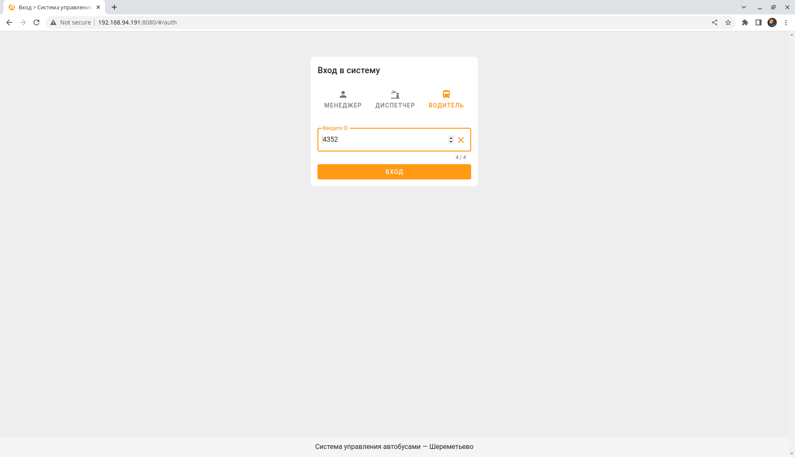
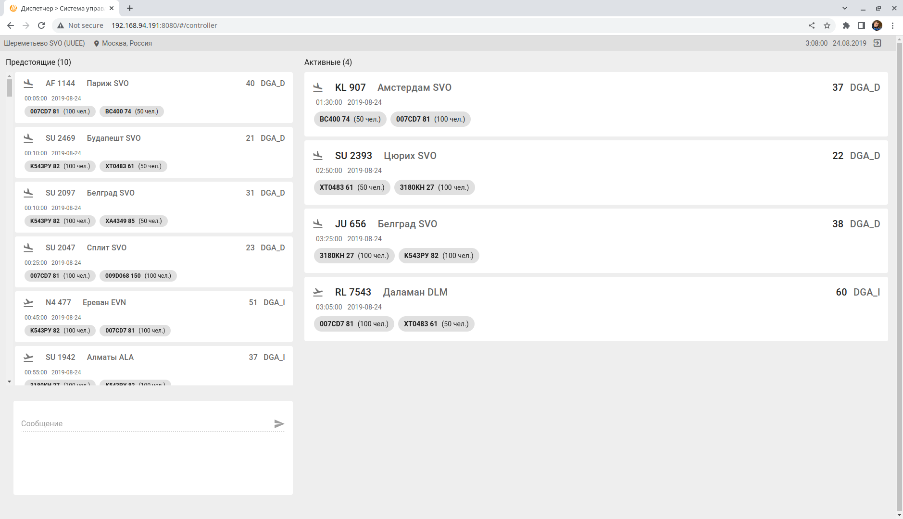

# Веб-интерфейс системы управления автобусами аэропорта Шереметьево

Кейс аэропорта Шереметьево на Авиахакатоне-2022





## Переменные окружения для docker и docker-compose

API endpoint: ```SVO_API_ENDPOINT```, стандартное значение: 	```http://<host>:5000/svo/```

## Установка зависимостей
```
yarn install
```

### Сервер для разработки
```
yarn serve
```

### Сборка 
```
yarn build
```

### Линтер и проверка файлов
```
yarn lint
```

### Дополнительно
см. [Configuration Reference](https://cli.vuejs.org/config/).
